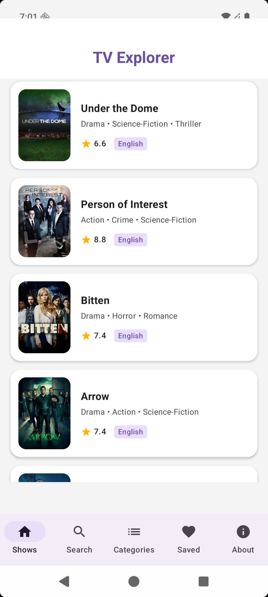
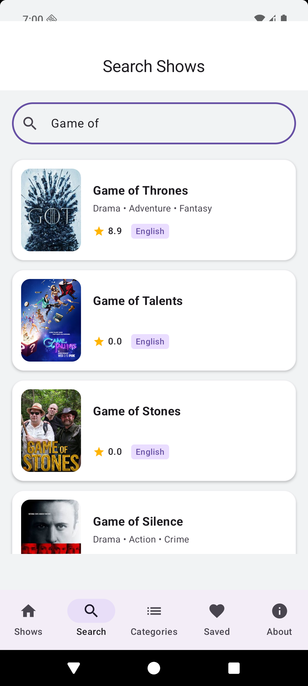
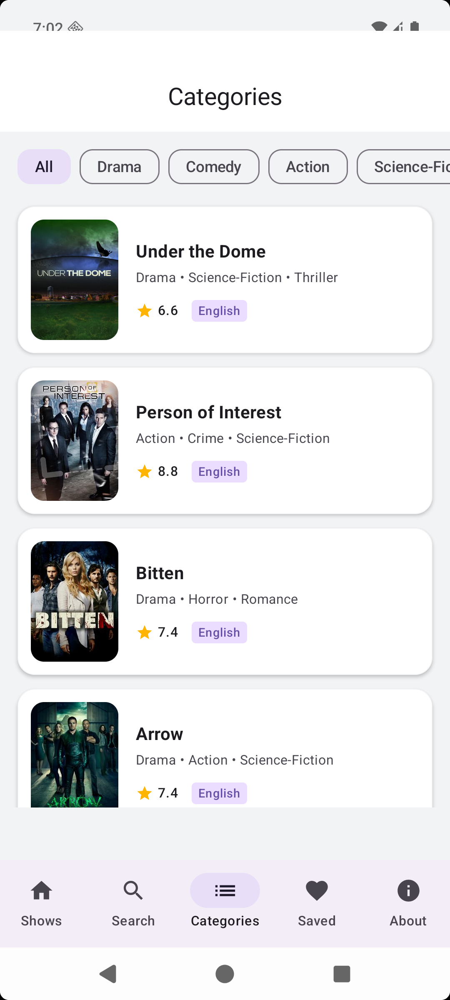
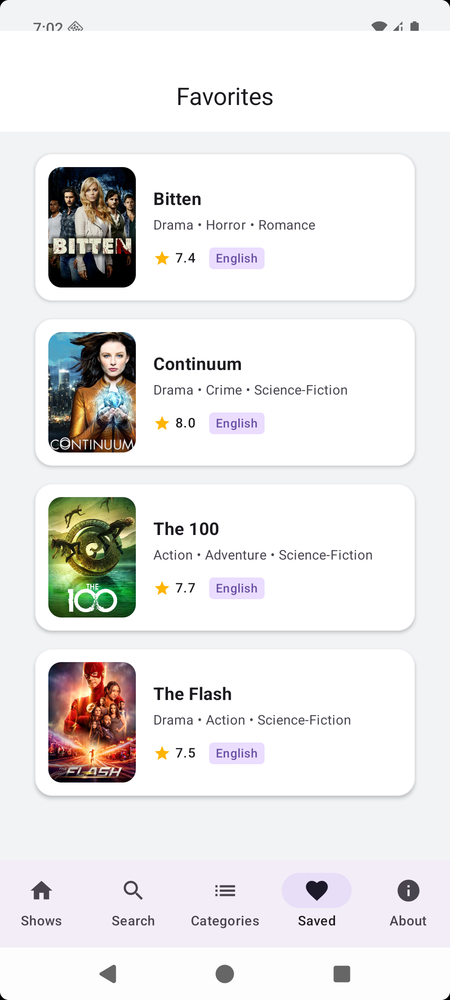
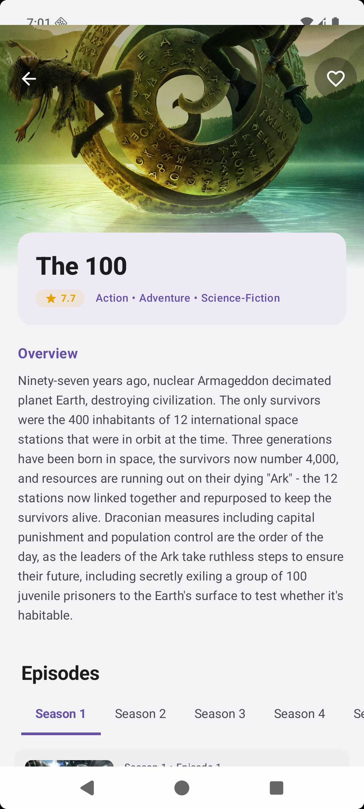

# Android Showcase

This gallery highlights the Android experience for the KMP TV Shows Explorer app. Screenshots are named by platform and screen purpose so they are easy to reference from GitHub, blog posts, and portfolio write-ups.

## Screen Gallery

| Screen | Preview | File |
| --- | --- | --- |
| Shows list |  | `docs/screenshots/android/android-shows-list.png` |
| Search results |  | `docs/screenshots/android/android-search-results.png` |
| Categories |  | `docs/screenshots/android/android-categories.png` |
| Saved favorites |  | `docs/screenshots/android/android-saved-favorites.png` |
| Show detail |  | `docs/screenshots/android/android-show-detail.png` |

## Blog Notes

- The Android app uses Compose Multiplatform with Material-style bottom navigation.
- Core flows shown here: discovery, search, category filtering, saved favorites, and show details.
- Shared KMP data and domain layers keep business logic reusable while allowing platform-specific UI presentation.
